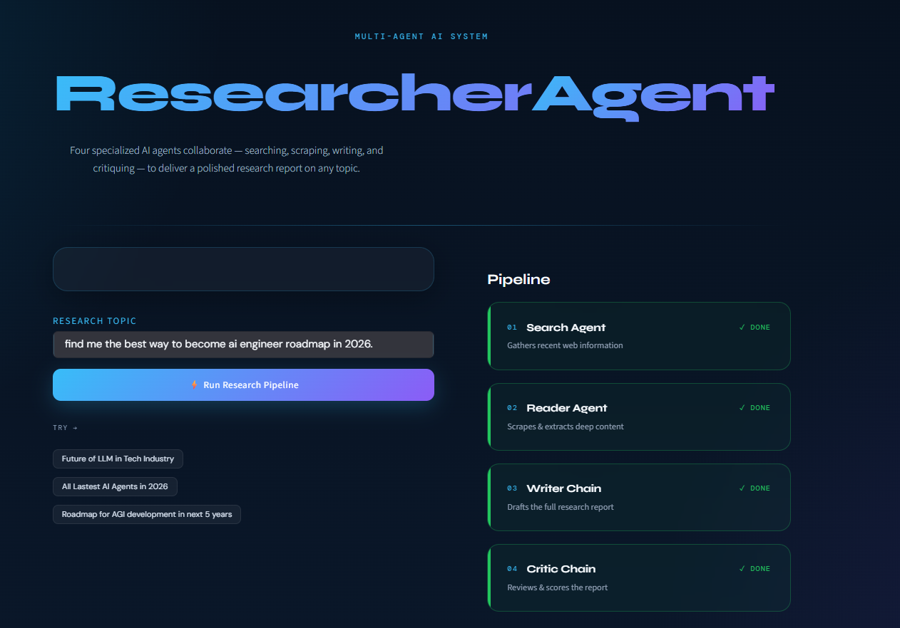
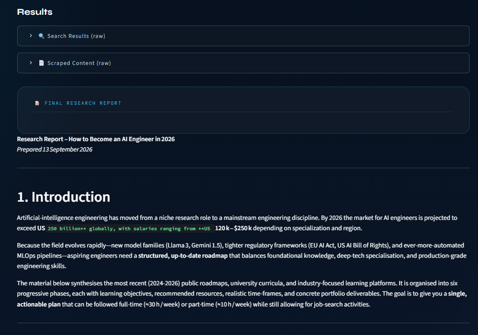
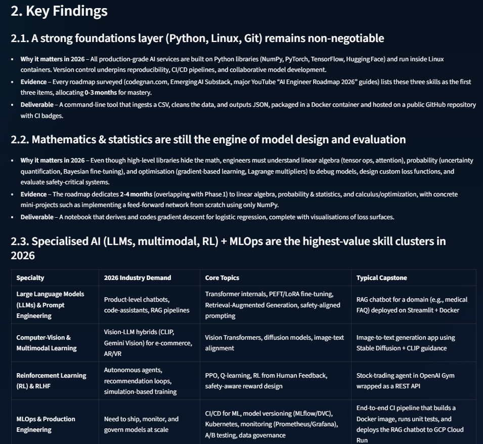
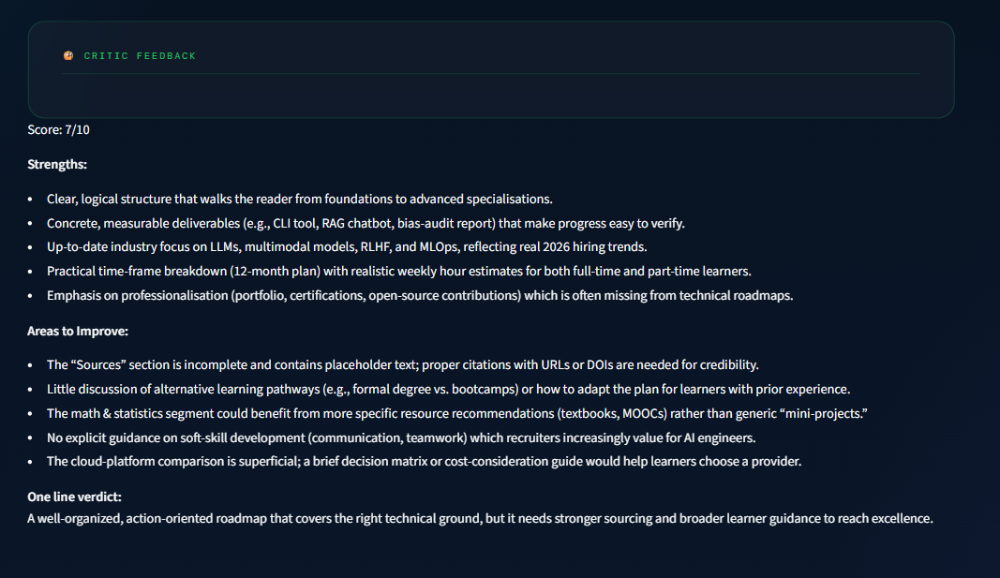
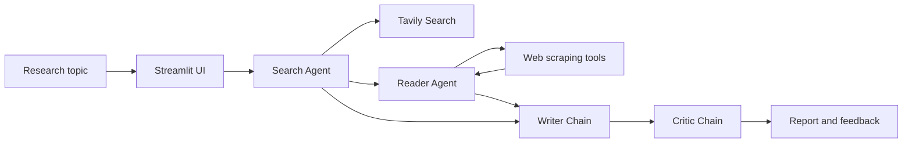

# Multi-Agent Research System

A research assistant that combines specialized AI agents to search the web, extract useful source content, write a structured report, and critique the final result. The project includes a Streamlit interface for interactive research and a Python entry point for running the pipeline from code.

## Features

- Search Agent finds recent information with Tavily Search.
- Reader Agent selects a relevant result and extracts readable page content.
- Writer Chain turns the gathered research into a structured report.
- Critic Chain scores the report and identifies strengths and areas to improve.
- Streamlit UI exposes the pipeline stages and lets users download the report as Markdown.
- Multiple extraction strategies improve resilience when scraping different web pages.

## Screenshots

### Research workspace



### Pipeline in progress



### Generated report



### Critic feedback



## Architecture

The application follows a sequential research workflow. The search and reader stages are tool-enabled LangChain agents. The writer and critic stages are prompt chains that use the same Groq-backed chat model.



### Pipeline stages

1. The Search Agent calls Tavily and returns titles, URLs, and snippets.
2. The Reader Agent chooses a relevant URL and calls `scrape_url`.
3. `scrape_url` tries Trafilatura, Readability, and BeautifulSoup extraction strategies.
4. The Writer Chain combines search results and scraped content into a report with sources.
5. The Critic Chain reviews the report and returns a score, strengths, improvements, and verdict.

## Technologies

- **Python 3.11** - application runtime
- **Streamlit** - web interface
- **LangChain, LangChain Core, LangChain Community** - agents, prompts, tools, and chains
- **LangChain Groq** - Groq model integration
- **Groq** - LLM provider using `openai/gpt-oss-120b`
- **Tavily** - web search API
- **Requests** - HTTP requests for source pages
- **Trafilatura, Readability, BeautifulSoup, lxml** - web content extraction
- **python-dotenv** - local environment variable loading
- **Rich** - terminal output formatting

## Installation

### 1. Clone the repository

```bash
git clone <repository-url>
cd Multi-Agent-Research-System---Langchain
```

### 2. Create and activate an environment

Using Conda:

```bash
conda create -n langagent python=3.11 -y
conda activate langagent
```

Or using Python's built-in virtual environment:

```bash
python -m venv .venv
```

Activate it on Windows:

```powershell
.venv\Scripts\Activate.ps1
```

Activate it on macOS or Linux:

```bash
source .venv/bin/activate
```

### 3. Install dependencies

```bash
python -m pip install --upgrade pip
python -m pip install -r requirements.txt
```

### 4. Configure API keys

Create a `.env` file in the project root:

```dotenv
GROQ_API_KEY=your_groq_api_key
TAVILY_API_KEY=your_tavily_api_key
```

Get keys from [Groq](https://console.groq.com/keys) and [Tavily](https://app.tavily.com/). Never commit `.env` or expose API keys in source control.

## Usage

### Streamlit application

Start the interactive web app:

```bash
streamlit run app.py
```

Enter a topic, run the pipeline, inspect the raw search and reader outputs, then download the generated report as a Markdown file.

### Python pipeline

Run the example configured in `main.py`:

```bash
python main.py
```

For programmatic use, import `run_research_pipeline`:

```python
from src.pipelines.pipeline import run_research_pipeline

result = run_research_pipeline("The impact of AI on the job market in 2026")
print(result["report"])
print(result["feedback"])
```

## Project Structure

```text
.
├── app.py                    # Streamlit application
├── main.py                   # CLI-style example runner
├── requirements.txt          # Python dependencies
├── assets/                   # README screenshots
└── src/
	├── agents/agents.py      # Groq model, agents, writer, and critic chains
	├── pipelines/pipeline.py # Sequential research pipeline
	└── tools/tools.py        # Tavily search and web scraping tools
```

## Notes and Limitations

- Search and generation require valid Groq and Tavily API keys.
- Web pages may block automated requests or contain content that cannot be extracted reliably.
- The generated report should be reviewed against the linked sources before being used for high-stakes decisions.
- API usage may incur costs or be subject to provider rate limits.

## License

This project is available under the [MIT License](LICENSE).